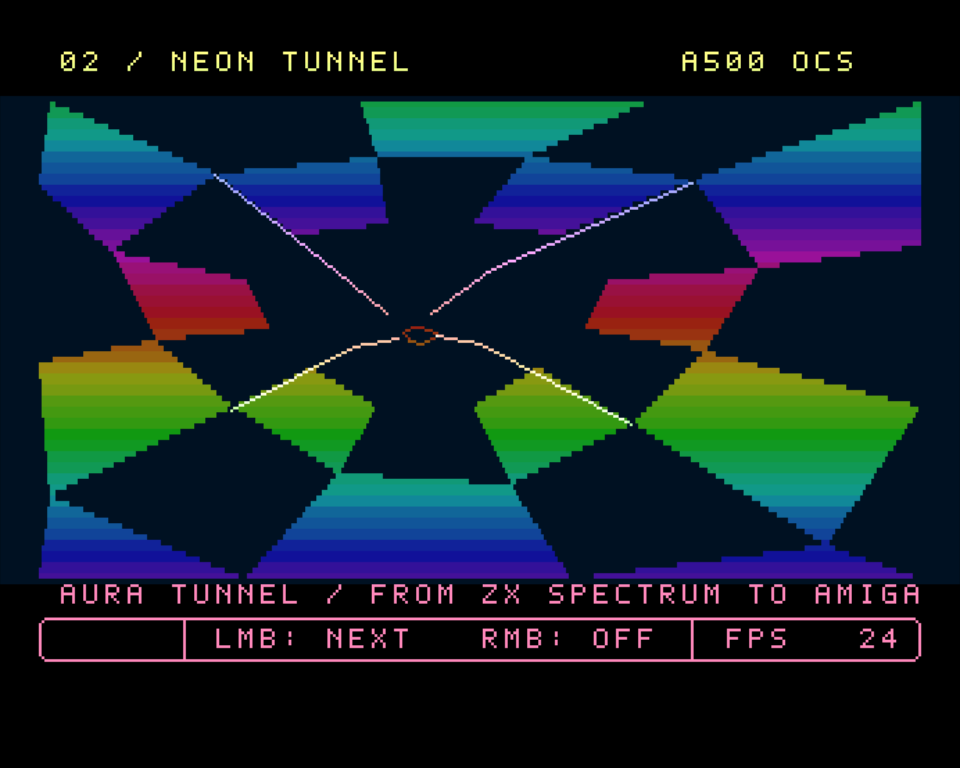
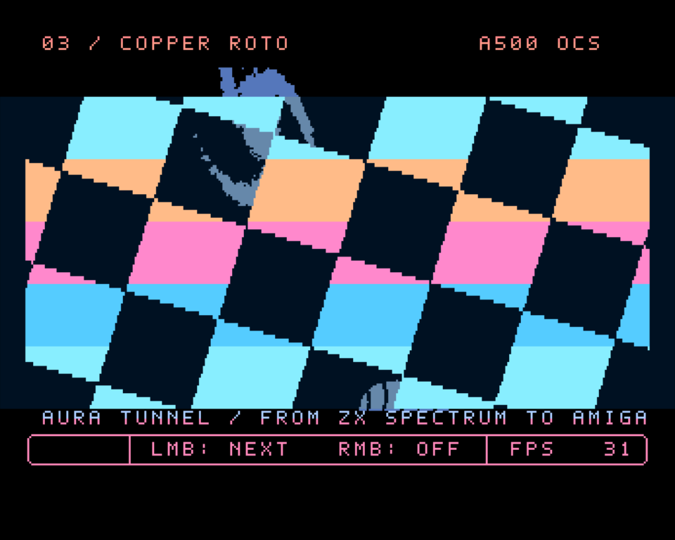
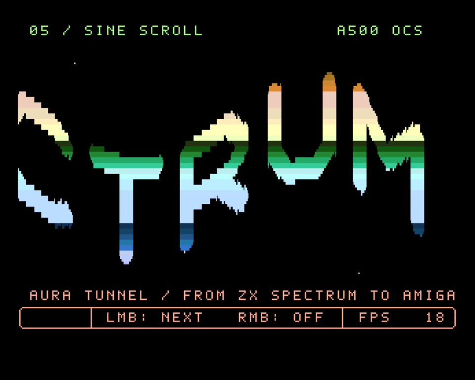
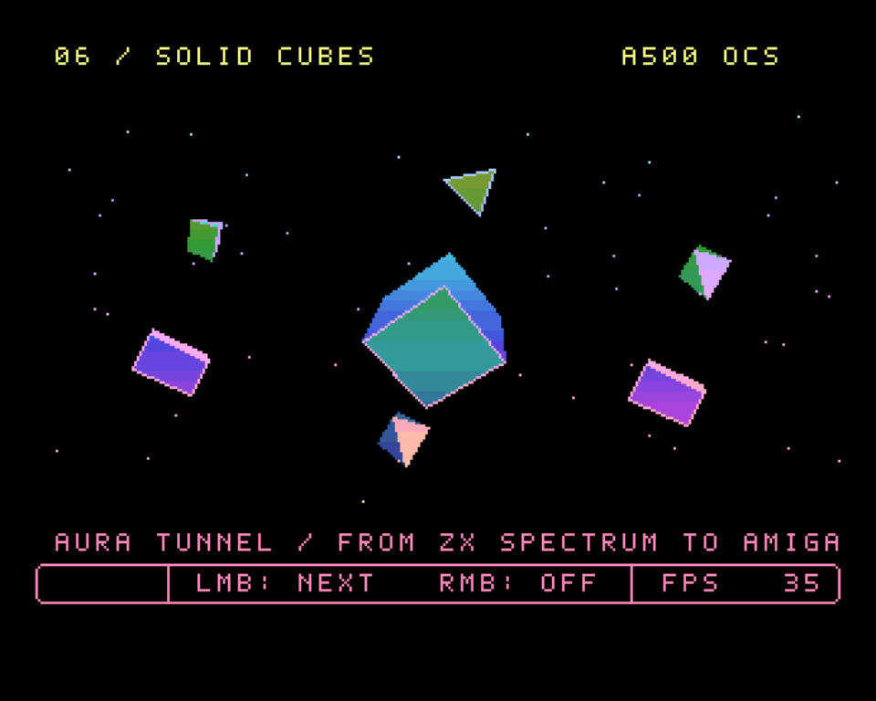
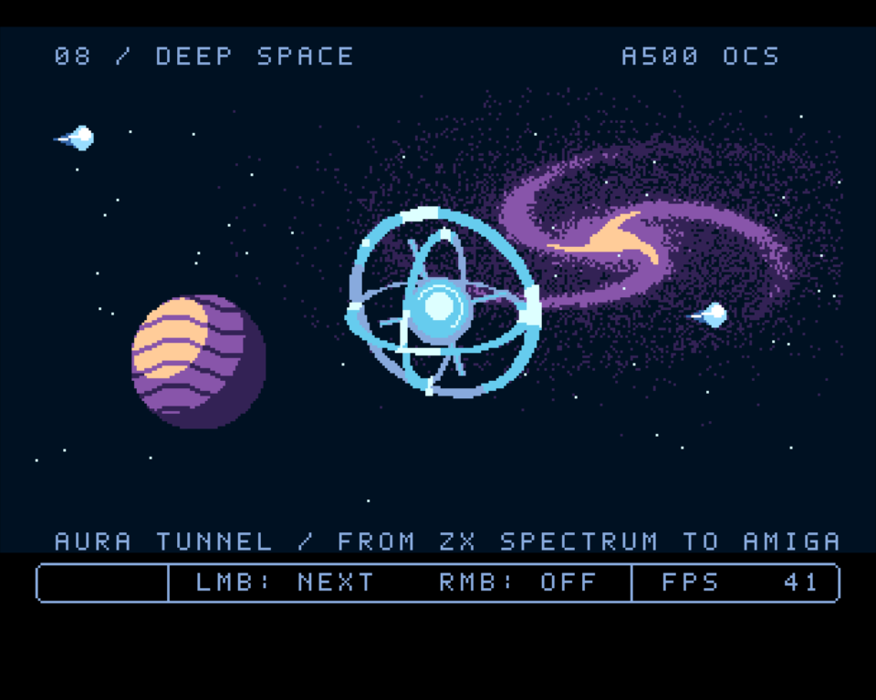
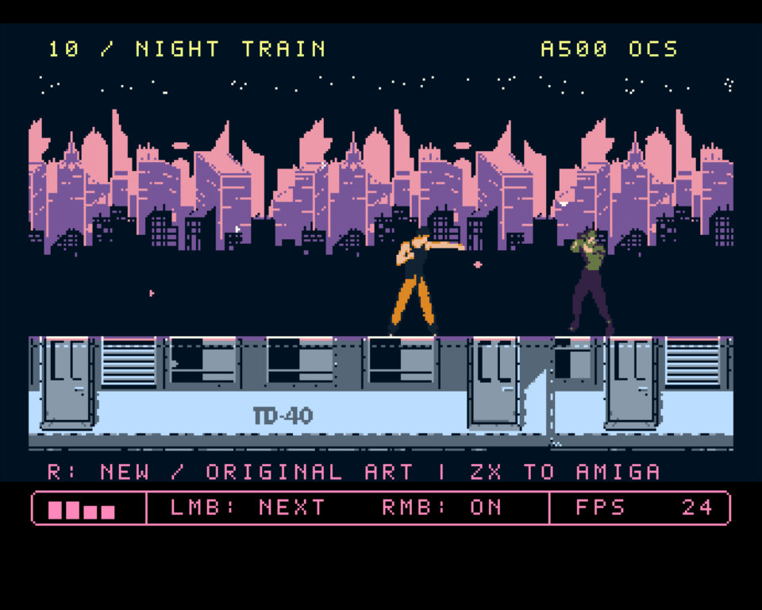

# Aura Tunnel Amiga

An Amiga 500 / OCS demo built with AI, and a companion to
[Aura Tunnel for ZX Spectrum](https://github.com/danamini/aura-tunnel).

I had a ZX Spectrum and an Amiga as a child. This project is a way of returning
to those computers, using AI to help me realise ideas I wouldn't be able to
build on them on my own. I chose the scenes, watched the demos run and kept
shaping how they looked and sounded. AI helped with the research, code, artwork
preparation and experiments with the hardware.

Both demos follow the same ten-scene sequence, so I can compare what the two
machines can do. The Amiga version uses its colour, sprites, Copper and blitter
for twisting tunnels, rotating checker planes, chrome lettering and animated
3D shapes. Building them is also a way for me to learn how these machines work.

The tunnel has twelve wall facets, illuminated rails and travelling neon
colours. A galaxy rotates behind the roto's checker plane in the opposite
direction. Large scrolling letters twist through moving colour reflections,
while cubes, boxes, diamonds and pyramids tumble through a starfield.
Deep Space has a spinning orbital reactor, a planet and passing meteors.
On Night Train, two animated fighters ride the carriage roof against a
scrolling city skyline, with leaves blowing past.

Four-channel music combines lead, bass, arpeggio and drums. Themes, instruments
and fills change through the demo, with four level meters in the HUD.
[Listen to the music](dist/music-preview.wav), rendered from the score.

[Download the bootable ADF](dist/aura-tunnel-amiga.adf) with its
[notices](dist/NOTICE.txt), or build from source.

## Screenshots

Captured in FS-UAE using an Amiga 500 / PAL / OCS configuration.
Click an image for the full-size capture.

| Neon Tunnel | Copper Roto |
| --- | --- |
| [](docs/screenshots/neon-tunnel.png) | [](docs/screenshots/copper-roto.png) |
| **Big scroller** | **Solid shapes** |
| [](docs/screenshots/big-scroller.png) | [](docs/screenshots/solid-shapes.png) |
| **Deep Space** | **Night Train** |
| [](docs/screenshots/deep-space.png) | [](docs/screenshots/night-train.png) |

## Quick start

Run the demo in FS-UAE:

1. Download [aura-tunnel-amiga.adf](dist/aura-tunnel-amiga.adf).
2. Install [FS-UAE for macOS](https://fs-uae.net/download/macos/), Windows or Linux.
3. Open the ADF in FS-UAE using an Amiga 500 / PAL configuration.

From this repository, the included launcher does those setup steps for you:

```bash
cd /Users/daniel/per-dev/aura-tunnel-amiga
python3 tools/emulate.py
```

Booting takes around 30–40 seconds with cycle-exact floppy speed. For a
browser experiment, try [Copperline](https://copperline.dev/try/), an Amiga
WebAssembly emulator that supports loading ADF files. Browser compatibility and
Kickstart-ROM requirements can vary, so use FS-UAE when you want the closest
repeatable A500 comparison.

Run `make setup` to create a Python environment, install the pinned Pillow version
and build a pinned vasm revision. Then run `make test` and `make emu`. The macOS launcher defaults
to `/Applications/FS-UAE.app/Contents/MacOS/fs-uae`; set `FS_UAE` for another path.
FS-UAE's internal AROS replacement ROM boots the disk without a proprietary ROM.

The output is `build/aura-tunnel-amiga.adf`. Target settings are PAL A500, OCS,
normal-speed cycle-exact 68000, 512 KiB CHIP, 512 KiB slow, no fast RAM.

## Controls

- Left mouse: next scene. Right mouse or M: music on/off. The HUD shows its state and four channel levels.
- R: bodies/dots in Dot Runner; new/original art in Night Train. Each scene shows a prompt.
- 1 through 9, then 0: select the ten scenes directly.
- Space: pause/resume scene time for inspection. Audio timing continues.
- F5/F6: save emulator states 1/2. F7: save a screenshot. F12: emulator menu.

The runner scene lasts 15.36 seconds, with slow and fast companions and a
bright on-screen R prompt. The graph scene runs the complete calculation
without artificial pacing and shows a measured implementation comparison:
Spectrum ROM BASIC versus native 68000 fixed-point arithmetic. It is not a
BASIC-to-BASIC or CPU-only benchmark. See [measurement details](docs/graph-comparison.md).

Read the [implementation notes](docs/implementation-plan.md) for research and
validation details. `tools/read_snapshot.py --save` reads counters from the running
immutable build, not from symbols belonging to a later rebuild.

The repository naming convention is `aura-tunnel-<platform>` for companion ports.
`aura-tunnel` remains the original Spectrum repository; this port is
[`aura-tunnel-amiga`](https://github.com/danamini/aura-tunnel-amiga).

This repository is separate from the Spectrum source. Its pinned references and
hashes are in `assets/reference`. See `CREDITS.md` for artwork, motion and music.

Night Train's artwork mode pairs Mustermann with Jones and uses credited CC0
city/train strips. The central chrome scroller uses 640 horizontal pixels with
Copper-repeated rows, a larger sine range and moving chrome reflections.
The A, I, Z, X, S, C, T and M letters periodically spin through 16 poses;
upright and rotating letters retain all 128 source columns. The smaller scroller also rolls individual letters at a slower
pace so the comparison message stays readable.
